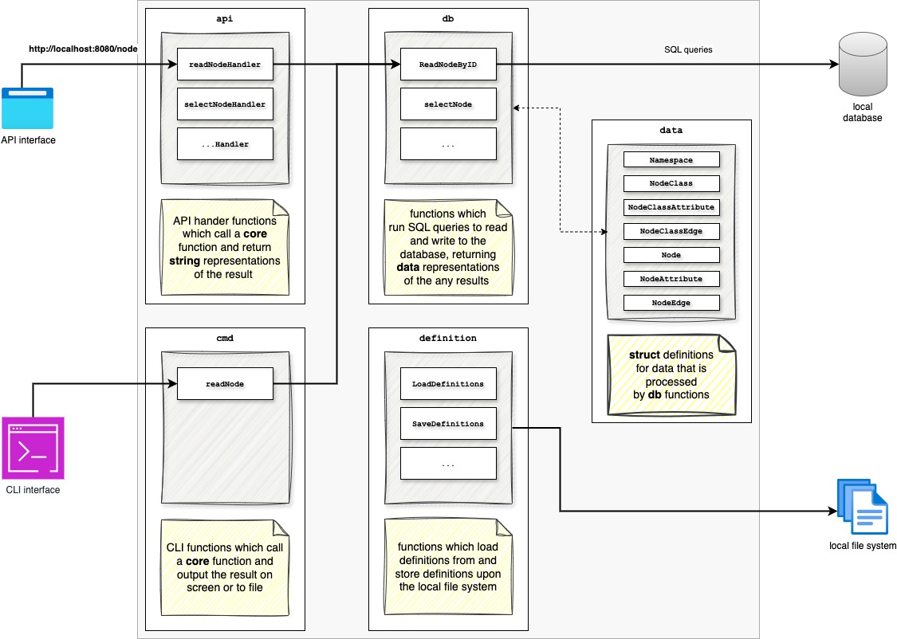

# Definition Graph

`definition-graph` is a golang-based utility which enables graph-orientated data structures to be defined in simple `json` or `yaml` files. These definition files can - and should - be stored within a source code management system, allowing graph-based models to be controlled using standard development workflows, notably including authentication & authorisation-based controls, and implicit auditability. `definition-graph` provides the ability for definition files to be quickly validated, parsed and converted into a graph representation.

`definition-graph` provides an API and command-line interface in which to interact with the utility. `definition-graph` also provides functionality to produce simple reports from the resulting graph using [go template](https://pkg.go.dev/text/template) syntax. This is typically used to produce `html` or `json` summaries of specific subsets of the data.

`definition-graph` currently uses the [sqlite](https://www.sqlite.org) for the database implementation.

_Note: `definition-graph` is currently still in development and is subject to breaking changes._

### Code Package Structure
